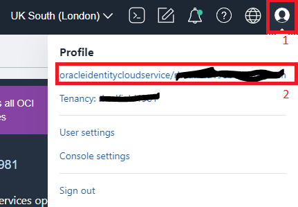
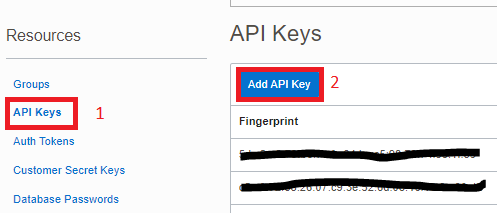
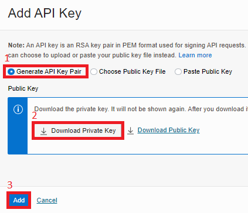

# Project to create OCI Object Storage and S3 authentication for Terraform Remote State
---
### Run this prior to the main project if you wish to utilise a remote statefile.
---
  
* This project makes use of a secret key to emulate bucket access in the same manner as AWS S3 storage.  
* Note that providers.tf will need to reflect the values created within this project

This project has followed the information outlined [here](https://docs.oracle.com/en-us/iaas/Content/API/SDKDocs/terraformUsingObjectStore.htm)

### Prerequisites
* An Oracle Cloud account [sign-up](https://signup.cloud.oracle.com/?language=en&sourceType=:ow:o:p:feb:0916FreePageBannerButton&intcmp=:ow:o:p:feb:0916FreePageBannerButton)
* OCI CLI configured [readme](https://docs.oracle.com/en-us/iaas/Content/API/Concepts/cliconcepts.htm)
* Terraform installed [readme](https://learn.hashicorp.com/tutorials/terraform/install-cli)

### How to run this project
1. Ensure that you have a working Oracle Cloud CLI environment and associated config file and api key `~/.oci/config ~/.oci/<my_api_key>.pem`
2. `terraform init`
3. `terraform plan`
4. `terraform apply`
5. Please create a credentials file at **~/.oci/credentials** as per the [guide](https://docs.oracle.com/en-us/iaas/Content/API/SDKDocs/terraformUsingObjectStore.htm) such that it looks similar to the following:  
`[default]    ` 
`aws_access_key_id=ocid1.credential.oc1..exampleuniqueID`
`aws_secret_access_key=mSTdaWThisIsAnExampleDoNotCopyMe52xlImWjayJLJ6OH9A=`

### Why use a remote state file?   
The main advantage of a remote state file is that it allows collaboration with multiple developers able to work on the terraform code.  A secondary benefit is that the statefile persists seperately from the code and will survive any local catastrophies that might otherwise destroy the statefile.

Unfortunately Oracle Cloud does not support a means for remote state locking with bucket storage.  There is an Oracle product ***Resource Manager*** that supports remote state and locking however this is beyond the scope of this project, more information can be found [here](https://www.oracle.com/uk/devops/resource-manager/)

Terraform outlines the benefits of remote statefiles [here](https://www.terraform.io/language/state/remote)

### How to create an API Key  
 Login to your Oracle Cloud account and then access your user profile.  
  1. Click on your account
  2. Click on you OCID

   

Create an API key, maximum of 3 in a free-tier account.  
  1. Click on **API Keys**
  2. Click on **Add API Key**

 

Use the default settings to generate the API key.  

  1. Select **Generate API Key Pair**
  2. Click **Download Private Key** you will not be able to access this again!
  3. Click **Add**

   

